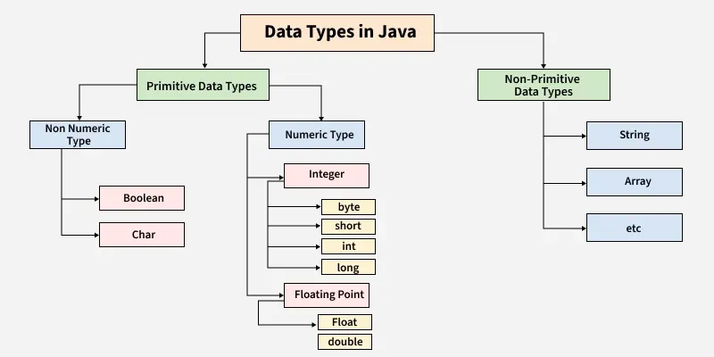

[Datatypes](https://www.geeksforgeeks.org/java/java-data-types/)

Remember:  In Java SE 8 and later, we can use the int data type to represent an unsigned 32-bit integer, which has a value in the range [0, 2  32  -1]. Use the Integer class to use the int data type as an unsigned integer.

Remember:  In Java SE 8 and later, you can use the long data type to represent an unsigned 64-bit long, which has a minimum value of 0 and a maximum value of 2  64  -1. The Long class also contains methods like comparing Unsigned, divide Unsigned, etc to support arithmetic operations for unsigned long. 

Note: String cannot be modified after creation. Use StringBuilder for heavy string manipulation

byte x = 127;
x++;
System.out.println(x);

-128

long l = 2147483648L;
int i = (int) l;
System.out.println(i);

Casting long to int causes overflow, resulting in a negative value.

int a = 1_000_000;
float b = a;
System.out.println(b == a);

Every array type implements the interfaces Cloneable and java.io.Serializable.

Underscores in numeric literals are just for readability

[Quiz](https://www.geeksforgeeks.org/quizzes/data-types-2-gq/)

