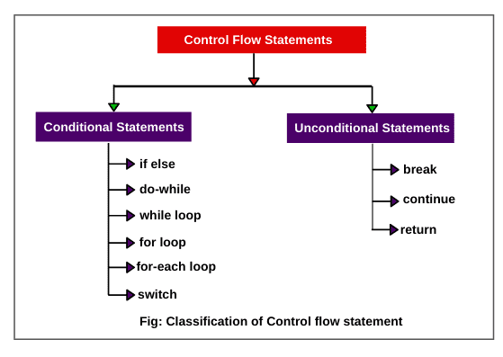

# ☕ Java Data Types — Quick Recap

## 🧩 Data Types Overview


Java provides two broad categories of data types:

- **Primitive Data Types** (byte, short, int, long, float, double, char, boolean)
- **Non-Primitive Data Types** (String, Arrays, Classes, Interfaces, etc.)

---

## ⚙️ Java SE 8 and Later — Unsigned Integers

- **Unsigned `int`:**
    - Represents an unsigned 32-bit integer
    - Range: `[0, 2^32 - 1]`
    - Use **`Integer`** class methods to perform unsigned arithmetic.

- **Unsigned `long`:**
    - Represents an unsigned 64-bit integer
    - Range: `[0, 2^64 - 1]`
    - Use **`Long`** class methods like:
        - `compareUnsigned()`
        - `divideUnsigned()`
        - `remainderUnsigned()`

---

## 🧠 Important Notes

- **Strings are immutable** — once created, they cannot be changed.  
  👉 Use **`StringBuilder`** for heavy string manipulations.

- **Arrays**
    - Every array type implements:
        - `Cloneable`
        - `java.io.Serializable`

- **Underscores (`_`) in numeric literals**
    - Used **only for readability**.
    - Example:
      ```java
      int a = 1_000_000; // same as 1000000
      ```

---

## 🧪 Code Examples & Explanations

### 🔸 Example 1: Byte Overflow
```java
byte x = 127;
x++;
System.out.println(x);
```
**Output:** `-128`  
👉 Because byte range is `[-128, 127]`. Incrementing 127 wraps around to -128 (overflow).

---

### 🔸 Example 2: Type Casting (long → int)
```java
long l = 2147483648L;
int i = (int) l;
System.out.println(i);
```
**Explanation:**  
Casting `long` to `int` causes **overflow**, since int range is smaller (`-2^31 to 2^31 - 1`).  
Result → Negative value.

---

### 🔸 Example 3: Float Precision Issue
```java
int a = 1_000_000;
float b = a;
System.out.println(b == a);
```
**Output:** `false`  
Because float cannot represent large integers precisely — it loses precision beyond 16 million.

---

## 🔄 Control Flow & Loops Overview

### 🔹 Control Flow in Java


### 🔹 Different Types of Loops


---

## 🧩 Quiz Time
Test your understanding here → [Data Types Quiz (GeeksforGeeks)](https://www.geeksforgeeks.org/quizzes/data-types-2-gq/)

---

### ✅ Summary

| Concept | Description | Notes |
|----------|--------------|-------|
| **Primitive Types** | byte, short, int, long, float, double, char, boolean | Stored directly in memory |
| **Non-Primitive Types** | String, Arrays, Classes, Interfaces | References to objects |
| **Unsigned Int/Long** | Introduced in Java 8 | Use Integer/Long helper methods |
| **StringBuilder** | Mutable string type | Best for performance-heavy concatenations |
| **Array Interfaces** | Cloneable, Serializable | Support cloning and serialization |
| **Numeric Literals** | Can include `_` | Improves readability |
| **Overflow** | Wrap-around behavior in fixed-size types | Common in byte/int conversions |

---
